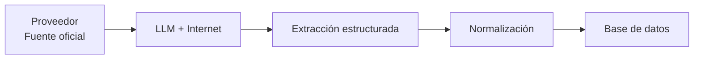
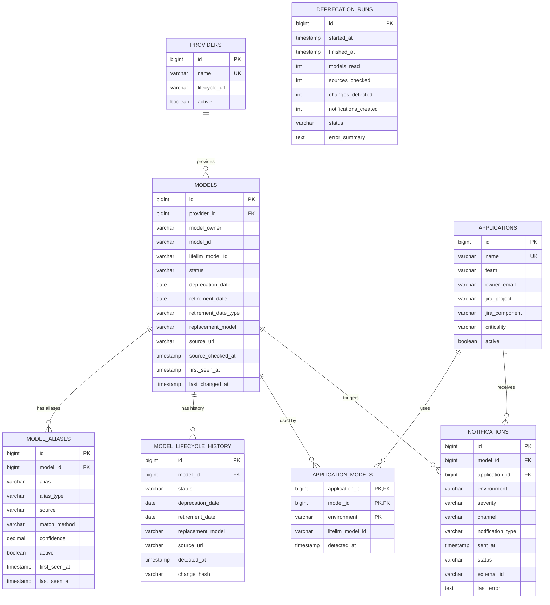

# Construye un microservicio completo de detección y gestión de deprecación de modelos LLM

Construye una solución completa, funcional y ejecutable de principio a fin para detectar anticipadamente la deprecación o retirada de modelos LLM utilizados por aplicaciones corporativas, identificar las aplicaciones afectadas y notificar automáticamente a los equipos responsables.

**No te detengas a preguntar, excepto en la modificación/creación de tablas en la base de datos.** Toma decisiones razonables cuando exista alguna ambigüedad, documenta las decisiones tomadas y continúa con la implementación.

Al finalizar debes:

1. Haber implementado el microservicio completo.
2. Haber implementado las pruebas unitarias e integración necesarias.
3. Haber ejecutado tú mismo las pruebas.
4. Haber verificado el flujo end-to-end.
5. Presentar una tabla de criterios de aceptación con resultado real `PASS/FAIL`.
6. Documentar cualquier decisión o desviación respecto a esta especificación.
7. Entregar un README completo con instrucciones de ejecución, configuración y operación.

---

# 1. Objetivo

El objetivo es garantizar que ninguna aplicación utilice en producción, PRE u otro entorno un modelo que haya sido deprecado o retirado por su fabricante sin que los responsables hayan sido avisados con suficiente antelación.

El proceso debe:

```text
Fuentes oficiales de proveedores de modelos, fuentes de secundarias de confianza
             │
             ▼
      LLM con Internet
             │
             ▼
Información estructurada
de lifecycle de modelos
             │
             ▼
     Normalización
             │
             ▼
      Base de datos
             │
             ├──────────────┐
             ▼              ▼
      Modelos afectados   Histórico
             │
             ▼
       Impact Analysis
             │
             ▼
    Severidad / prioridad
             │
       ┌─────┼
       ▼     ▼
    Jira   Teams
             │
             ▼
       Seguimiento
             │
             ▼
   Nueva comprobación
```

El proceso se ejecutará periódicamente mediante una función CRON configurable.

La frecuencia inicial será **diario**.

---

# 2. Decisión arquitectónica principal

La solución debe utilizar el **enfoque: LLM con acceso a Internet**.



NO implementar scraping manual específico para cada proveedor como mecanismo principal.

Las únicas fuentes válidas para determinar lifecycle son las **fuentes oficiales de los fabricantes**.

El LLM será responsable de consultar/analizar dichas fuentes y devolver la información estructurada.

La solución debe estar preparada para que las páginas de los proveedores cambien su estructura sin que tengamos que implementar y mantener un scraper HTML específico para cada una.

---

# 3. Proveedores

Actualmente trabajamos únicamente con:

* Anthropic
* Google Gemini
* Google Vertex AI
* OpenAI

No añadir otros proveedores salvo que sea necesario para desacoplar la implementación.

Los proveedores deben ser configurables.

---

# 4. Fuentes de verdad

Las fuentes oficiales son la única fuente autorizada para determinar:

* existencia del modelo;
* estado del modelo;
* fecha de deprecación;
* fecha de retirada/shutdown;
* tipo de fecha;
* modelo sustituto/recomendado;
* cualquier información adicional de lifecycle.

Utiliza y configura las URLs oficiales correspondientes a:

### Anthropic

Página oficial de deprecaciones de modelos Claude:

- `https://docs.anthropic.com/en/docs/about-claude/model-deprecations`

### Google Gemini

Página oficial de deprecaciones de Gemini API:

- `https://ai.google.dev/gemini-api/docs/deprecations`
- `https://docs.cloud.google.com/gemini-enterprise-agent-platform/models/model-versions`
- `https://docs.cloud.google.com/gemini-enterprise-agent-platform/models/deprecations/open-models`
- `https://docs.cloud.google.com/gemini-enterprise-agent-platform/models/deprecations/partner-models`

### Google Vertex AI

Utilizar la documentación oficial de lifecycle/deprecations de modelos de Vertex AI.

- `https://docs.cloud.google.com/vertex-ai/generative-ai/docs/release-notes`
- `https://docs.cloud.google.com/gemini-enterprise-agent-platform`

### OpenAI

Utilizar las páginas/documentación oficial de modelos y lifecycle de OpenAI.

- `https://developers.openai.com/api/docs/models/all`
- `https://developers.openai.com/api/docs/models`
- `https://developers.openai.com/api/docs/deprecations`

### BenchLM

Recopila información oficial de lifecycle/deprecations de modelos de varios proveedores y la muestra en formato calendario.

- `https://benchlm.ai/deprecations`


**IMPORTANTE:**

No utilices:

* GitHub como fuente de verdad.
* Reddit.
* Blogs.
* Stack Overflow.
* artículos de terceros.
* páginas de agregadores.
* documentación no oficial que no se haya señalado como importante a tener en cuenta.

Si existe información contradictoria entre fuentes, prevalece la fuente oficial del proveedor correspondiente.

La URL exacta utilizada debe quedar registrada en la base de datos.

---

# 5. LiteLLM

Toda la comunicación con los modelos y el descubrimiento de modelos debe realizarse a través del gateway LiteLLM corporativo.

El servicio tendrá una variable:

```text
LITELLM_BASE_URL
```

No hardcodear URLs.

El mismo gateway LiteLLM se utilizará para:

1. ejecutar el LLM encargado de investigar las deprecaciones;
2. obtener los modelos disponibles/utilizados;
3. obtener información adicional de modelos disponibles/utilizados.

El modelo utilizado para investigar las fuentes debe ser configurable:

```text
DEPRECATION_RESEARCH_MODEL
```

Ejemplo conceptual:

```text
LITELLM_BASE_URL = https://<gateway>
DEPRECATION_RESEARCH_MODEL = <modelo>
```

## 5.1. Invocación del LLM para investigación

El servicio utilizará el gateway corporativo LiteLLM para ejecutar el modelo encargado de investigar la información de lifecycle de los modelos.

La aplicación no debe comunicarse directamente con OpenAI, Anthropic, Google, Vertex u otros proveedores de LLM.

La comunicación se realizará mediante la API compatible con OpenAI expuesta por LiteLLM. LiteLLM proporciona una interfaz unificada para acceder a distintos proveedores mediante formatos de entrada/salida compatibles.

### Endpoint
```http
POST {LITELLM_BASE_URL}/v1/chat/completions
```

### Configuración

El modelo utilizado para la investigación debe ser configurable:

```text
DEPRECATION_RESEARCH_MODEL
´´´

El prompt del sistema debe ser configurable.

Se recomienda soportar ambas opciones:

```text
SYSTEM_PROMPT
SYSTEM_PROMPT_FILE
```

Donde:

* `SYSTEM_PROMPT` permite definir directamente el prompt.
* `SYSTEM_PROMPT_FILE` permite cargar el prompt desde un fichero versionado.

Si ambas están configuradas, `SYSTEM_PROMPT_FILE` tendrá prioridad.

El prompt no debe estar hardcodeado en el código fuente.

### Autenticación

La credencial de LiteLLM debe configurarse mediante variable de entorno o mecanismo equivalente de secrets:

```text
LITELLM_API_KEY
```

Nunca incluir la API key en código fuente, logs o configuración versionada.

### Request

La petición seguirá el formato Chat Completions:

```http
POST {LITELLM_BASE_URL}/v1/chat/completions
Authorization: Bearer ${LITELLM_API_KEY}
Content-Type: application/json
```

Ejemplo:

```json
{
  "model": "${DEPRECATION_RESEARCH_MODEL}",
  "messages": [
    {
      "role": "system",
      "content": "${SYSTEM_PROMPT}"
    },
    {
      "role": "user",
      "content": "${RESEARCH_QUERY}"
    }
  ]
}
```

LiteLLM utiliza este formato compatible con OpenAI para las peticiones de chat.

### System prompt

El system prompt debe definir como mínimo:

1. El objetivo del servicio.
2. Que debe investigar exclusivamente información relacionada con lifecycle/deprecación/retirada de modelos.
3. Las fuentes oficiales que debe consultar.
4. Que las fuentes oficiales son la fuente de verdad.
5. Que debe distinguir entre:
    - modelo activo;
    - modelo anunciado como deprecated;
    - fecha de deprecación;
    - fecha de retirada/shutdown;
    - fecha desconocida;
    - sustituto recomendado.
6. Que no debe inventar fechas.
7. Que debe indicar cuándo un dato no está disponible.
8. Que debe devolver exclusivamente el JSON definido por el contrato.
9. Que debe incluir la URL de la fuente utilizada para cada dato relevante.
10. Que debe indicar su nivel de confianza cuando exista ambigüedad.

### User prompt

La consulta enviada como user debe contener dinámicamente la información que se quiere investigar.

Por ejemplo:

```text
Analiza el lifecycle de los siguientes modelos.

Proveedor:
Anthropic

Modelos:
- anthropic/claude-sonnet-4-20250514
- anthropic/claude-haiku-3-20240307

Fuente oficial:
<URL>

Contexto:
Estos modelos pueden estar siendo utilizados por aplicaciones
corporativas a través del gateway LiteLLM.

Necesitamos conocer:
- estado actual;
- fecha de deprecación;
- fecha de retirada;
- tipo de retirada;
- modelo sustituto recomendado;
- URL exacta de la fuente;
- fecha de comprobación.

Devuelve exclusivamente el JSON definido por el schema.
```

El servicio debe generar esta consulta a partir de los modelos obtenidos del inventario LiteLLM y de las fuentes oficiales configuradas.
---

# 6. Descubrimiento de modelos mediante LiteLLM

Utiliza los endpoints correspondientes de LiteLLM para obtener el inventario de modelos.

Como mínimo:

```http
GET /models
```

y:

```http
GET /model/info
```

Utiliza exactamente los endpoints, parámetros y headers soportados por la versión de LiteLLM desplegada.

No inventes contratos.

Consulta/verifica la documentación oficial de LiteLLM si es necesario:
`https://www.litellm.org/#`
`https://docs.litellm.ai/docs/`

La URL final será:

```text
{LITELLM_BASE_URL}/models
```

y:

```text
{LITELLM_BASE_URL}/model/info
```

El servicio debe soportar:

* autenticación configurable;
* timeout configurable;
* retries;
* logging;
* errores de conexión;
* respuestas vacías;
* modelos duplicados.

No debe fallar todo el proceso porque un modelo concreto no tenga información adicional.

La respuesta esperada del endpoint ```text {LITELLM_BASE_URL}/models``` es:

```
    "data": [
        {
            "id": "vertex_ai/claude-opus-4-8",
            "object": "model",
            "created": 1677610602,
            "owned_by": "openai",
            "mode": "chat",
            "max_input_tokens": 1000000,
            "max_output_tokens": 128000
        },
        ...,
        {
            "id": "gemini-3.6-flash",
            "object": "model",
            "created": 1677610602,
            "owned_by": "openai",
            "mode": "chat",
            "max_input_tokens": 1048576,
            "max_output_tokens": 65536
        },
    ]
```

La respuesta esperada del endpoint ```text {LITELLM_BASE_URL}/model/info``` es:

```
{
    "data": [
        {
            "model_name": "vertex_ai/claude-opus-4-8",
            "litellm_params": {
                "vertex_location": "global",
                "litellm_credential_name": "VertexAI",
                "use_in_pass_through": false,
                "use_litellm_proxy": false,
                "use_xai_oauth": false,
                "merge_reasoning_content_in_choices": false,
                "model": "vertex_ai/claude-opus-4-8"
            },
            "model_info": {
                "id": "16f6379e-5ec1-4bc1-bc3b-3d48a27f44fc",
                "db_model": true,
                "blocked": false,
                "access_via_team_ids": [
                    "CSW-004582",
                    "CSW-003761",
                    "LAB-001",
                    "CSW-002949",
                    "CSW-004040",
                    "CSW-004308"
                ],
                "direct_access": true,
                "key": "vertex_ai/claude-opus-4-8",
                "max_tokens": 128000,
                "max_input_tokens": 1000000,
                "max_output_tokens": 128000,
                "input_cost_per_token": 5e-06,
                "input_cost_per_token_flex": null,
                "input_cost_per_token_priority": null,
                "cache_creation_input_token_cost": 6.25e-06,
                ...
                ]
            }
        },
        ...
    ]
}

```

---

# 7. Problema fundamental: nombres de modelos

Los nombres de modelos utilizados internamente o por LiteLLM pueden NO coincidir exactamente con los nombres publicados por el fabricante.

Por ejemplo:

```text
LiteLLM:
anthropic/claude-sonnet-4
```

puede corresponder a:

```text
Proveedor:
claude-sonnet-4-20250514
```

Por tanto:

**NO asumir que `litellm_model_id == provider_model_id`.**

La solución debe disponer de una estrategia explícita de normalización/matching.

Debe distinguir:

```text
Modelo interno
Modelo LiteLLM
Modelo del proveedor
Alias
```

Implementar una tabla de aliases/mappings si es necesario.

La estrategia debe priorizar:

1. mapping exacto;
2. mapping previamente conocido/configurado;
3. equivalencias deterministas;
4. sugerencia del LLM;
5. revisión manual cuando exista ambigüedad.

**Nunca generar una notificación crítica basándose únicamente en un matching ambiguo.**

Cuando el matching no pueda determinarse con seguridad, registrar:

```text
MATCH_REVIEW_REQUIRED
```

y dejar trazabilidad.

---

# 8. Investigación mediante LLM

El microservicio debe enviar al modelo LLM:

* contexto del problema;
* lista de proveedores;
* URLs oficiales;
* instrucciones explícitas;
* modelo(s) a investigar;
* definición exacta del JSON esperado;
* reglas de validación;
* prohibición de utilizar fuentes secundarias.

El LLM tendrá acceso a Internet.

El system prompt debe indicarle que:

1. solo puede utilizar las fuentes oficiales o de información proporcionadas;
2. debe consultar dichas fuentes;
3. debe buscar información de lifecycle;
4. debe distinguir deprecation de retirement/shutdown;
5. debe indicar cuando una fecha no existe;
6. no debe inventar fechas;
7. no debe inferir una fecha que no esté respaldada;
8. debe devolver únicamente JSON estructurado;
9. debe incluir la URL de la fuente;
10. debe indicar qué información no ha podido determinar.

---

# 9. Contrato JSON del LLM

El LLM debe devolver exactamente un objeto estructurado equivalente a:

```json
{
  "provider": "anthropic",
  "models": [
    {
      "provider_model_id": "claude-example",
      "status": "deprecated",
      "deprecation_date": "2026-10-01",
      "retirement_date": "2026-12-01",
      "retirement_date_type": "exact",
      "replacement_model": "claude-replacement",
      "evidence": "short factual description of the information found",
      "source_url": "https://docs.anthropic.com/en/docs/about-claude/model-deprecations",
      "checked_at": "2026-09-12T08:00:00Z",
      "confidence": "high"
    }
  ]
}
```

Valores permitidos:

```text
status:
- active
- legacy
- deprecated
- retired
- unknown
```

```text
retirement_date_type:
- exact
- earliest_possible
- announced
- unknown
```

```text
confidence:
- high
- medium
- low
```

Las fechas deben utilizar:

```text
YYYY-MM-DD
```

Y los timestamp deben utilizar:

```text
YYYY-MM-DDTHH:mm:ss.sssZ
```

Si una fecha no existe:

```json
null
```

No utilizar fechas inventadas.

---

# 10. Validación del JSON

Nunca confiar directamente en la respuesta del LLM.

Implementar:

1. JSON parsing.
2. JSON Schema validation.
3. Validación semántica.
4. Validación de fechas.
5. Validación de enums.
6. Validación de campos obligatorios.
7. Validación de URL.
8. Validación de coherencia.

Ejemplos:

```text
retirement_date >= deprecation_date
```

cuando ambas existan.

No aceptar:

```text
status = active
retirement_date = 2020-01-01
```

sin registrar la anomalía.

Las fechas anteriores a la fecha de comprobación no deben rechazarse por ser
antiguas. Si están respaldadas por una fuente oficial, siguen siendo necesarias
para detectar incumplimientos: un modelo deprecado o retirado que continúa en uso
representa un riesgo actual. En ese caso:

* `deprecation_date < today` debe indicar que la migración está atrasada;
* `retirement_date < today` debe indicar que la retirada ya se ha producido;
* si la aplicación continúa utilizando el modelo, la severidad mínima debe ser
  `CRITICAL` y debe generarse o mantenerse la alerta;
* la fecha, la fuente y la evidencia deben conservarse en el estado actual y en el
  histórico.

Una fecha pasada solo debe quedar pendiente de revisión cuando sea incoherente,
contradictoria con la fuente oficial, carezca de evidencia suficiente o no pueda
asociarse con seguridad al modelo del inventario. La antigüedad por sí sola no es
motivo para ignorarla.

El schema debe almacenarse como artefacto del proyecto.

---

# 11. Base de datos

La base de datos PostgreSQL puede que exista parcialmente o sea necesario crear una nueva base de datos para este servicio. Esta es una de las decisiones que se deben de tomar, basándote en la base de datos existente `jdbc:postgresql://iagwcontrol-bdp01.db.gcp.mercadona.com:5432/iagwcontrol-llm`. Esta base de datos se utiliza en otro microservicio IAGWCONTROL (`https://gitlab.gcp.mercadona.com/integrations/ai/tooling/control-plane`).



No asumir que se puede eliminar, recrear o modificar destructivamente la base de datos.

Antes de crear o modificar tablas:

* Inspeccionar el esquema existente.
* Identificar tablas y columnas existentes.
* Identificar constraints, índices y claves.
* Reutilizar las estructuras existentes cuando sean compatibles.
* Crear migraciones incrementales y versionadas.
* No eliminar datos existentes.
* No realizar cambios destructivos salvo que sean imprescindibles y estén documentados.
* Será necesaria la validación del usuario ante cualquier acción sobre una base de datos existente.

La aplicación debe utilizar migraciones versionadas.

El servicio tendrá una variable de la URL de la base de datos:

```text
DATABASE_URL
```

No hardcodear URLs.

---

# 12. Modelo de datos

Utilizar como base el siguiente modelo.

```text
PROVIDERS
MODELS
MODEL_ALIASES
MODEL_LIFECYCLE_HISTORY
APPLICATIONS
APPLICATION_MODELS
NOTIFICATIONS
DEPRECATION_RUNS
```

Las relaciones son:

```text
PROVIDERS 1 ─── N MODELS

MODELS 1 ─── N MODEL_ALIASES

MODELS 1 ─── N MODEL_LIFECYCLE_HISTORY

APPLICATIONS N ─── N MODELS
                 mediante APPLICATION_MODELS

MODELS 1 ─── N NOTIFICATIONS

APPLICATIONS 1 ─── N NOTIFICATIONS
```

---

# 13. Tabla PROVIDERS

```text
providers
---------
id
name
lifecycle_url
active
```

Debe representar los proveedores monitorizados.

Ejemplo:

```json
{
  "name": "anthropic",
  "lifecycle_url": "https://docs.anthropic.com/en/docs/about-claude/model-deprecations",
  "active": true
}
```

---

# 14. Tabla MODELS

Utilizar:

```text
models
------
id
provider_id
model_owner
model_id
litellm_model_id
status
deprecation_date
retirement_date
retirement_date_type
replacement_model
source_url
source_checked_at
first_seen_at
last_changed_at
```

Donde:

### `model_id`

Identificador canónico del modelo según el proveedor.

### `litellm_model_id`

Identificador utilizado por LiteLLM.

### `model_owner`

Fabricante real del modelo.

### `status`

Estado actual conocido.

### `deprecation_date`

Fecha de deprecación si existe.

### `retirement_date`

Fecha de retirada/shutdown si existe.

### `retirement_date_type`

Permitir distinguir una fecha exacta de una fecha "earliest possible".

### `replacement_model`

Modelo recomendado por el fabricante si existe.

### `source_url`

URL oficial de la que procede la información.

### `source_checked_at`

Fecha/hora de la última comprobación de esa fuente.

### `first_seen_at`

Primera vez que el sistema detectó el modelo.

### `last_changed_at`

Última modificación de información de lifecycle.

---

# 15. Aliases y normalización

Añadir una tabla `MODEL_ALIASES` si la implementación lo considera necesario, siguiendo este concepto:

```text
MODEL_ALIASES
-------------
id
model_id
alias
alias_type
source
match_method
confidence
active
first_seen_at
last_seen_at
```

Ejemplo:

```text
model_id = 123

alias:
anthropic/claude-sonnet-4-20250514

alias_type:
LITELLM

match_method:
EXACT

confidence:
1.0
```

Otro:

```text
alias:
claude-sonnet-prod

alias_type:
INTERNAL

match_method:
CONFIGURED

confidence:
1.0
```

No crear mappings falsos.

Una opción es establecer una estrategia en capas:

                    MODELO DE LITELLM
                           │
                           ▼
                  ¿Tenemos alias exacto?
                     /           \
                   Sí             No
                   │               │
                   ▼               ▼
                MATCH       ¿Tenemos mapping
                              configurado?
                             /          \
                           Sí            No
                           │              │
                           ▼              ▼
                         MATCH       MATCHING
                                     AUTOMÁTICO
                                          │
                                          ▼
                                   ¿Confianza alta?
                                    /          \
                                  Sí            No
                                  │              │
                                  ▼              ▼
                                MATCH       REVISIÓN
                                            MANUAL

---

# 16. Tabla MODEL_LIFECYCLE_HISTORY

Registrar cada cambio relevante:

```text
model_lifecycle_history
-----------------------
id
model_id
status
deprecation_date
retirement_date
replacement_model
source_url
detected_at
change_hash
```

La tabla debe permitir responder:

> ¿Qué sabía el sistema y cuándo lo supo?

No crear un nuevo registro si no ha cambiado la información relevante.

Utilizar `change_hash` para detectar cambios.

---

# 17. Tabla APPLICATIONS

```text
applications
------------
id
name
team
owner_email
jira_project
jira_component
criticality
active
```

Representa las aplicaciones corporativas.

`criticality` representa la criticidad de negocio de la aplicación.

Valores recomendados:

```text
low
medium
high
critical
```

---

# 18. Tabla APPLICATION_MODELS

```text
application_models
------------------
application_id
model_id
environment
litellm_model_id
detected_at
```

PK compuesta:

```text
application_id + model_id + environment
```

`environment` representa dónde utiliza la aplicación el modelo:

```text
DEV
ITG
PRE
PRO
```

Esta tabla responde:

> ¿Qué aplicación utiliza qué modelo y en qué entorno?

---

# 19. Tabla NOTIFICATIONS

```text
notifications
-------------
id
model_id
application_id
environment
severity
channel
notification_type
sent_at
status
external_id
last_error
```

Mantener `environment`.

Es importante porque una misma aplicación puede utilizar el mismo modelo en:

```text
DEV
ITG
PRE
PRO
```

y la criticidad puede ser diferente.

Ejemplo:

```text
application = chatbot
model = claude-x
environment = prod
severity = CRITICAL
channel = JIRA
```

`external_id` debe guardar el identificador externo:

```text
MKN-1234
```

cuando el canal sea Jira.

---

# 20. Tabla DEPRECATION_RUNS

Registrar cada ejecución:

```text
deprecation_runs
----------------
id
started_at
finished_at
models_read
sources_checked
changes_detected
notifications_created
status
error_summary
```

Valores:

```text
SUCCESS
PARTIAL
FAILED
```

Esto permitirá auditar las ejecuciones del proceso.

---

# 21. CRON

La ejecución será diaria.

Debe ser configurable mediante configuración externa.

Ejemplo:

```text
CRON_SCHEDULE="0 0 * * 1"
```

No hardcodear la frecuencia.

Permitir además ejecutar manualmente:

```text
POST /internal/runs
```

o mecanismo equivalente.

Una ejecución manual debe utilizar exactamente el mismo código que la ejecución CRON.

No duplicar lógica.

---

# 22. Flujo de ejecución

Implementar este flujo:

```text
1. Start run

2. Obtener modelos desde LiteLLM

3. Obtener información de model/info

4. Obtener fuentes oficiales configuradas

5. Enviar contexto + URLs + modelos al LLM

6. LLM consulta Internet

7. LLM devuelve JSON

8. Validar JSON Schema

9. Normalizar nombres

10. Resolver aliases/mappings

11. Comparar con DB

12. Detectar cambios

13. Guardar lifecycle actual

14. Guardar histórico

15. Identificar aplicaciones afectadas

16. Calcular severidad

17. Determinar si corresponde notificar

18. Crear/actualizar Jira

19. Enviar Teams

20. Registrar notifications

21. Finalizar run

22. En siguiente ejecución:
    volver a comprobar si las aplicaciones siguen usando el modelo
```

---

# 23. Fórmula de criticidad

Implementar una fórmula determinista y explicable.

No dejar que el LLM determine la severidad.

La severidad debe depender de:

1. entorno;
2. tiempo hasta deprecación;
3. tiempo hasta retirada;
4. criticidad de la aplicación.

## Peso por entorno

```text
PRO = 4
PRE  = 3
ITG = 2
DEV  = 1
```

## Peso por criticidad de aplicación

```text
critical = 4
high     = 3
medium   = 2
low      = 1
```

## Factor de tiempo

Si existe `retirement_date`, utilizar preferentemente el tiempo hasta retirada.

Si no existe, utilizar `deprecation_date`.

Definir:

```text
days_to_event =
    retirement_date - today
```

o, si no existe:

```text
days_to_event =
    deprecation_date - today
```

Escala:

```text
> 180 días  = 1
91-180      = 2
31-90       = 3
8-30        = 4
0-7         = 5
< 0         = 6
```

Calcular:

```text
risk_score =
    environment_weight
    *
    application_criticality_weight
    *
    time_weight
```

Mapear a:

```text
1-15   INFO
16-30  WARNING
31-60  HIGH
>60    CRITICAL
```

Ajustar los rangos si la distribución resultante no es razonable durante las pruebas.

La fórmula debe estar documentada y ser configurable.

Se debe evaluar siempre la severidad con la fecha del día de la
ejecución. Por tanto, si la ejecución es semanal, un modelo con 5 días hasta la retirada ya debe producir
`CRITICAL` aunque la ejecución anterior lo hubiera detectado con más antelación. La
frecuencia semanal no debe interpretarse como una garantía de aviso con siete días
de margen: para reducir ese riesgo, `CRON_SCHEDULE` debe poder configurarse con una
frecuencia diaria o inferior en entornos productivos.

---

# 24. Regla especial de producción

Si:

```text
environment = PRO
```

y:

```text
retirement_date <= 30 días
```

la severidad mínima debe ser:

```text
CRITICAL
```

Si:

```text
retirement_date < today
```

y la aplicación continúa utilizando el modelo:

```text
CRITICAL
```

y debe generarse una alerta.

La misma regla aplica cuando únicamente se cumple:

```text
deprecation_date < today
retirement_date = null
```

El modelo debe considerarse deprecado con la migración atrasada. Si continúa en
uso, se debe generar o mantener una alerta `CRITICAL`; no se debe interpretar la
ausencia de `retirement_date` como ausencia de riesgo.

---

# 25. Si no existe retirement_date

No asumir que el modelo no tiene riesgo.

Si únicamente existe:

```text
deprecation_date
```

usar esa fecha como fecha de referencia.

Registrar:

```text
retirement_date = null
```

y conservar:

```text
retirement_date_type = unknown
```

El mensaje debe indicar claramente:

> "El fabricante ha anunciado la deprecación, pero no se ha encontrado una fecha de retirada/shutdown."

---

# 26. Frecuencia de las notificaciones

No enviar una notificación cada vez que se ejecute el CRON.

Debe existir idempotencia.

Propuesta:

```text
>180 días
INFO
notificación inicial

180-91 días
WARNING
cada 30 días

90-31 días
HIGH
cada 14 días

30-8 días
CRITICAL
cada 7 días

7-1 días
CRITICAL
cada 2 días

retirada alcanzada
CRITICAL
diaria hasta que desaparezca el uso
```

Las frecuencias deben ser configurables.

No enviar una notificación duplicada para el mismo:

```text
model
application
environment
notification_type
period
```

---

# 27. Canales de notificación

Implementar dos canales:

```text
JIRA
TEAMS
```

Utilizar una arquitectura desacoplada:

```text
NotificationService
       │
       ├── JiraNotificationProvider
       └── TeamsNotificationProvider
```

Cada provider debe poder configurarse/desactivarse.

---

# 28. Mensaje común de notificación

Crear un modelo interno común:

```json
{
  "event_type": "MODEL_DEPRECATION",
  "severity": "HIGH",
  "provider": "anthropic",
  "model": {
    "model_id": "claude-example",
    "litellm_model_id": "anthropic/claude-example",
    "status": "deprecated",
    "deprecation_date": "2026-10-01",
    "retirement_date": "2026-12-01",
    "replacement_model": "claude-replacement",
    "source_url": "https://..."
  },
  "application": {
    "name": "example-app",
    "team": "example-team",
    "environment": "pro",
    "criticality": "high"
  },
  "action_required": true,
  "days_to_retirement": 80,
  "days_to_deprecation": 19
}
```

---

# 29. Jira

Para cada aplicación afectada debe existir un ticket de seguimiento.

El ticket debe contener como mínimo:

### Summary

```text
[LLM DEPRECATION][HIGH] <model> - <application> - <environment>
```

### Description

Incluir:

* proveedor;
* modelo;
* identificador LiteLLM;
* aplicación;
* equipo;
* entorno;
* fecha de deprecación;
* fecha de retirada;
* días restantes;
* modelo sustituto;
* URL oficial;
* acción requerida;
* fecha de detección;
* severidad.

No crear tags Jira adicionales salvo que sean estrictamente necesarios.

No implementar un workflow paralelo en la base de datos.

**Jira será el sistema de seguimiento.**

El servicio únicamente guardará el identificador del issue:

```text
external_id = "MKN-1234"
```

---

# 30. Seguimiento Jira

En cada ejecución posterior:

1. comprobar si la aplicación continúa utilizando el modelo;
2. si continúa:

   * mantener/escalar el ticket;
   * generar la notificación correspondiente;
3. si deja de utilizarlo:

   * registrar la resolución;
   * opcionalmente cerrar/transicionar Jira si la configuración lo permite.

No asumir que el ticket está resuelto simplemente porque el modelo ha sido sustituido en una configuración.

Tampoco asumir que el problema está resuelto porque el fabricante haya movido una
fecha de deprecación o retirada hacia el futuro. Si el modelo continúa en uso, el
ticket debe permanecer abierto y actualizarse con la nueva evidencia. La aplicación
debe registrar el cambio de fecha y recalcular la severidad, pero el cambio por sí
mismo no cierra el seguimiento.

La fuente de verdad para comprobar el uso debe ser el inventario obtenido desde LiteLLM/aplicaciones.

---

# 31. Teams

Utilizar el mecanismo corporativo/configurable disponible para enviar un mensaje estructurado.

El mensaje debe contener:

```text
🚨 LLM Model Deprecation

Modelo:
Proveedor:
Aplicación:
Entorno:
Severidad:

Deprecación:
Retirada:

Días restantes:

Modelo recomendado:

Acción requerida:

Jira:
Fuente oficial:
```

En cada ejecución, el mensaje de Teams debe incluir también un resumen de las fechas
movidas desde la ejecución anterior. Para cada modelo afectado indicar:

* fecha anterior y fecha nueva;
* si la deprecación o retirada se ha adelantado, retrasado o no ha cambiado;
* aplicación y entornos afectados;
* severidad anterior y nueva;
* si la evaluación de riesgo ha subido, bajado o quedado igual.

Los cambios deben calcularse comparando el estado actual con el último estado
persistido, no únicamente comparando la respuesta del LLM con la ejecución anterior.

Usar tarjetas/adaptive cards si el mecanismo corporativo disponible lo soporta.

Separar el contenido común del formato específico del canal.

---

# 33. Arquitectura interna

Utilizar una arquitectura modular similar a:

```text
                 ┌──────────────────┐
                 │       CRON       │
                 └────────┬─────────┘
                          │
                          ▼
                 ┌──────────────────┐
                 │ Deprecation      │
                 │ Orchestrator     │
                 └───────┬──────────┘
                         │
          ┌──────────────┼──────────────┐
          ▼              ▼              ▼
    LiteLLM Client   Research LLM   Database
          │              │
          │              ▼
          │        Source Research
          │              │
          └───────┬──────┘
                  ▼
            Normalizer
                  │
                  ▼
           Impact Analyzer
                  │
                  ▼
        Severity Calculator
                  │
                  ▼
        Notification Service
           │       │       │
           ▼       ▼       ▼
         Jira    Teams
```

---

# 34. API del microservicio

Implementar como mínimo:

```http
GET /health
```

```http
GET /ready
```

```http
POST /internal/runs
```

```http
GET /internal/runs/{id}
```

```http
GET /internal/models
```

```http
GET /internal/models/{id}
```

```http
GET /internal/models/{id}/history
```

```http
GET /internal/applications
```

```http
GET /internal/notifications
```

Los endpoints internos deben estar protegidos/configurados adecuadamente.

No exponer credenciales.

---

# 35. Configuración

Toda configuración debe estar externalizada.

Como mínimo:

```text
LITELLM_BASE_URL
LITELLM_API_KEY

DEPRECATION_RESEARCH_MODEL

DATABASE_URL

CRON_SCHEDULE

JIRA_BASE_URL
JIRA_API_TOKEN
JIRA_DEFAULT_PROJECT

TEAMS_ENABLED
TEAMS_WEBHOOK_URL

NOTIFICATION_DRY_RUN

LOG_LEVEL
```

No almacenar secretos en el código.

No hacer commit de secretos.

---

# 36. Dry Run

Implementar:

```text
NOTIFICATION_DRY_RUN=true
```

Cuando esté activo:

* ejecutar todo el proceso;
* detectar modelos;
* calcular impacto;
* calcular severidad;
* generar mensajes;
* NO enviar Jira;
* NO enviar Teams.

Registrar qué habría enviado.

Esto es obligatorio para poder validar el sistema inicialmente.

---

# 37. Resiliencia

El fallo de un proveedor o canal no debe detener todo el proceso.

Ejemplo:

```text
Anthropic → OK
Google → OK
Vertex → ERROR
OpenAI → OK
```

Resultado:

```text
RUN = PARTIAL
```

pero se procesan Anthropic, Google y OpenAI.

Lo mismo para notificaciones:

```text
Jira → OK
Teams → ERROR
```

Debe registrarse el fallo y continuar.

Implementar:

* timeout;
* retry;
* backoff;
* logging;
* circuit breaker si resulta necesario;
* errores parciales.

---

# 38. Seguridad

No almacenar:

* API keys;
* passwords;
* tokens;
* credenciales Jira;
* secretos Teams.

Utilizar variables de entorno/secrets.

No enviar secretos al LLM.

El prompt enviado al LLM debe contener únicamente la información necesaria.

---

# 39. Observabilidad

Implementar logs estructurados.

Cada ejecución debe tener:

```text
run_id
timestamp
provider
model
application
environment
severity
notification_channel
duration_ms
status
```

Ejemplo:

```json
{
  "event": "model_deprecation_detected",
  "run_id": "abc123",
  "provider": "anthropic",
  "model": "claude-example",
  "retirement_date": "2026-12-01",
  "applications_affected": 4
}
```

No registrar secretos.

---

# 40. Idempotencia

El proceso debe poder ejecutarse varias veces sin crear:

* modelos duplicados;
* históricos duplicados;
* mappings duplicados;
* Jira duplicados;
* notificaciones duplicadas.

Especial atención a Jira.

Antes de crear un issue nuevo buscar si ya existe un issue abierto para:

```text
model_id
application_id
environment
```

Si existe:

```text
actualizar
```

en lugar de crear otro.

---

# 41. Tests

Implementar como mínimo:

### Unit tests

* parsing JSON LLM;
* JSON Schema;
* normalización;
* matching de modelos;
* cálculo de días;
* cálculo de severidad;
* política de notificaciones;
* idempotencia.

### Integration tests

* LiteLLM;
* PostgreSQL;
* Jira mock;
* Teams mock;
* Resiliencia de canales.

### E2E

Simular:

```text
modelo activo
     ↓
modelo deprecado
     ↓
modelo con 90 días
     ↓
modelo con 30 días
     ↓
modelo retirado
     ↓
aplicación migra
     ↓
ticket deja de necesitar seguimiento
```

---

# 42. Casos de prueba obligatorios

Implementar al menos estos casos:

### Caso 1

```text
prod
critical
>180 días
```

Resultado:

```text
INFO
```

### Caso 2

```text
prod
critical
60 días
```

Resultado:

```text
HIGH
```

### Caso 3

```text
prod
critical
20 días
```

Resultado:

```text
CRITICAL
```

### Caso 4

```text
pre
medium
20 días
```

Resultado menor que PRO crítico.

### Caso 5

Modelo sin `retirement_date`.

Debe utilizar `deprecation_date`.

### Caso 6

Modelo retirado pero todavía utilizado en PRO.

Debe producir:

```text
CRITICAL
```

### Caso 7

Modelo deprecado pero ninguna aplicación lo utiliza.

No generar notificación de aplicación.

### Caso 8

El LLM devuelve JSON inválido.

La ejecución debe fallar de forma controlada.

### Caso 9

LiteLLM no responde.

Registrar `PARTIAL`/`FAILED` correctamente.

### Caso 10

Jira falla.

Teams debe poder continuar.

### Caso 11

La ejecución se repite.

No debe crear duplicados.

### Caso 12

El nombre LiteLLM no coincide exactamente con el proveedor.

Debe resolverse mediante alias/mapping o quedar marcado para revisión.

---

# 43. Criterios de aceptación

Al terminar presenta esta tabla con resultados REALES:

| #  | Criterio                                  | Resultado | Evidencia |
| -- | ----------------------------------------- | --------- | --------- |
| 1  | Servicio arranca                          |           |           |
| 2  | Health funciona                           |           |           |
| 3  | PostgreSQL conectado                      |           |           |
| 4  | LiteLLM `/models/` funciona               |           |           |
| 5  | LiteLLM `/model/info` funciona            |           |           |
| 6  | LLM puede consultar las fuentes oficiales |           |           |
| 7  | LLM devuelve JSON estructurado            |           |           |
| 8  | JSON Schema se valida                     |           |           |
| 9  | Modelos se normalizan                     |           |           |
| 10 | Aliases/mappings funcionan                |           |           |
| 11 | Lifecycle se persiste                     |           |           |
| 12 | Histórico funciona                        |           |           |
| 13 | Aplicaciones afectadas se identifican     |           |           |
| 14 | Environment se tiene en cuenta            |           |           |
| 15 | Severidad se calcula correctamente        |           |           |
| 16 | Política de frecuencia funciona           |           |           |
| 17 | Jira funciona                             |           |           |
| 18 | Teams funciona                            |           |           |
| 19 | Idempotencia funciona                     |           |           |
| 20 | Dry-run funciona                          |           |           |
| 21 | CRON es configurable                      |           |           |
| 22 | Fallos parciales se soportan              |           |           |
| 23 | Seguimiento Jira funciona                 |           |           |
| 24 | E2E completo funciona                     |           |           |

No marcar un criterio como PASS simplemente porque el código exista.

Debe existir evidencia real de ejecución.

---

# 44. Artefactos que debes entregar

Al terminar, entrega:

```text
README.md

src/
tests/

migrations/

schemas/
    deprecation-response.schema.json

prompts/
    deprecation-research-system-prompt.txt

docker/
    Dockerfile

docker-compose.yml

.env.example

openapi.yaml

architecture/
    architecture.mmd

scripts/
    verify.sh
```

La estructura concreta puede variar si existe una razón técnica.

---

# 45. README

El README debe explicar:

1. qué hace el servicio;
2. arquitectura;
3. dependencias;
4. configuración;
5. variables de entorno;
6. base de datos;
7. migraciones;
8. LiteLLM;
9. LLM de investigación;
10. fuentes oficiales;
11. algoritmo de matching;
12. fórmula de severidad;
13. política de notificaciones;
14. Jira;
15. Teams;
16. CRON;
17. dry-run;
18. ejecución manual;
19. tests;
20. troubleshooting.

---

# 46. Diagrama de arquitectura

Genera también un diagrama Mermaid que represente:

```text
                 FUENTES OFICIALES
          ┌──────────┬──────────┬──────────┬──────────┐
          │Anthropic │  Google  │  OpenAI  │ BenchLM  │
          └────┬─────┴────┬─────┴────┬─────┴────┬─────┘
               │          │          │          │
               └──────────┼──────────┘──────────┘
                          ▼
                 LLM + Internet
                          │
                          ▼
                 JSON estructurado
                          │
                          ▼
                    Normalización
                          │
              ┌───────────┴───────────┐
              │                       │
              ▼                       ▼
         Lifecycle DB           LiteLLM inventory
                                      │
                                      ▼
                              Application mapping
                                      │
                         ┌────────────┴────────────┐
                         ▼                         ▼
                  Impact Analysis          Severity Engine
                                                   │
                                  ┌────────────────┼───────────────┐
                                  ▼                ▼               ▼
                                Jira             Teams
                                  │
                                  ▼
                              Seguimiento
                                  │
                                  ▼
                           Nueva comprobación
```

---

# 47. Decisiones importantes

Estas decisiones son obligatorias:

### Fuente de verdad

Solo proveedores oficiales y fuentes secundarias especificadas.

### Base de datos

Crear una nueva para este microservicio o utilizar una existente.

### Obtención

LLM con acceso a Internet.

### Resultado LLM

JSON estructurado + JSON Schema.

### Lifecycle

La BD almacena estado actual + histórico.

### Inventario

LiteLLM.

### Matching

Explícito y trazable.

### Seguimiento

Jira.

### Notificación

Jira + Teams. No se envían avisos por correo.

### Frecuencia de búsqueda

Diaria y configurable.

### Severidad

Determinista y calculada por el servicio.

### Environment

Forma parte del impacto.

### Idempotencia

Obligatoria.

### Dry-run

Obligatorio.

### Fuentes secundarias

No utilizar a no ser que se especifique.

---

# 48. Qué NO hacer

No:

* implementar scraping específico como mecanismo principal;
* utilizar fuentes secundarias sin especificar;
* confiar ciegamente en el LLM;
* aceptar JSON sin validación;
* asumir que los nombres LiteLLM y proveedor coinciden;
* generar notificaciones por matching ambiguo;
* hardcodear URLs;
* hardcodear API keys;
* crear un Jira por cada ejecución;
* enviar notificaciones duplicadas;
* crear un workflow de seguimiento paralelo a Jira;
* crear tags Jira innecesarios;
* cerrar un ticket únicamente porque ha pasado tiempo;
* considerar que un modelo está activo si una fuente no responde;
* marcar PASS en tests que no se hayan ejecutado realmente.

---

# 49. Resultado final esperado

La solución final debe permitir ejecutar:

```text
CRON diario
      │
      ▼
LiteLLM → modelos actuales
      │
      ▼
Fuentes oficiales
      │
      ▼
LLM + Internet
      │
      ▼
JSON lifecycle
      │
      ▼
Validación
      │
      ▼
Normalización / Mapping
      │
      ▼
PostgreSQL
      │
      ▼
¿Qué aplicaciones están afectadas?
      │
      ▼
¿Cuándo se depreca/retira?
      │
      ▼
¿Cuál es la severidad?
      │
      ▼
¿Debemos notificar?
      │
      ├──────────────┬──────────────┐
      ▼              ▼              ▼
    Jira           Teams
      │
      ▼
Seguimiento
      │
      ▼
Siguiente ejecución
      │
      ▼
¿La aplicación sigue utilizando el modelo?
      │
      ├── Sí → continuar seguimiento
      │
      └── No → resolver seguimiento
```

La implementación debe ser suficientemente modular para poder sustituir posteriormente el proveedor LLM, el mecanismo de notificación o las fuentes sin rediseñar el núcleo del servicio.

**No pares para pedir confirmaciones, excepto en la modificación de la base de datos (si se opta por utilizar una BD existente). Construye, ejecuta, verifica y documenta.**
