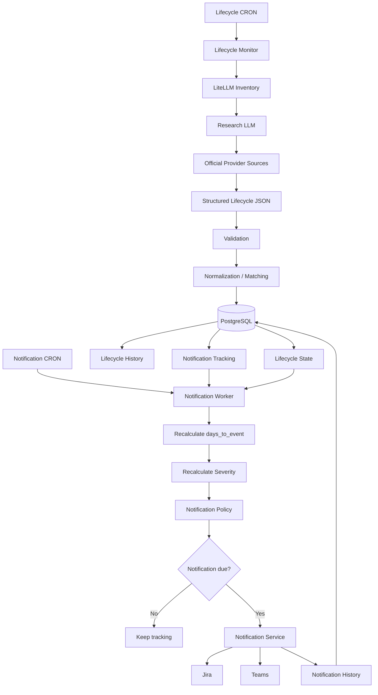

# Construye una solución completa de supervisión y notificación de deprecación de modelos LLM

Construye una solución completa, funcional y ejecutable de principio a fin para detectar anticipadamente la deprecación o retirada de modelos LLM utilizados por aplicaciones corporativas, identificar las aplicaciones afectadas, mantener el seguimiento del riesgo y notificar automáticamente a los equipos responsables.

La arquitectura debe separar explícitamente dos responsabilidades:

1. **Supervisión del lifecycle de los modelos.**
2. **Planificación y envío de notificaciones.**

Ambos procesos deben estar desacoplados y poder ejecutarse con frecuencias diferentes.

**No te detengas a preguntar, excepto antes de cualquier creación o modificación de tablas en una base de datos existente.**

Cuando exista alguna ambigüedad:

* toma una decisión técnica razonable;
* documenta la decisión;
* continúa con la implementación;
* no inventes contratos de APIs ni datos externos.

Al finalizar debes:

1. Haber implementado la solución completa.
2. Haber implementado el Lifecycle Monitor.
3. Haber implementado el Notification Scheduler/Worker.
4. Haber implementado las pruebas unitarias e integración necesarias.
5. Haber ejecutado las pruebas.
6. Haber verificado el flujo end-to-end.
7. Presentar una tabla de criterios de aceptación con resultado real `PASS/FAIL`.
8. Documentar cualquier decisión o desviación respecto a esta especificación.
9. Entregar un README completo con instrucciones de ejecución, configuración y operación.
10. Demostrar que monitorización y notificación pueden ejecutarse independientemente.

---

# 1. Objetivo

El objetivo es garantizar que ninguna aplicación utilice en producción, PRE u otro entorno un modelo que haya sido deprecado o retirado por su fabricante sin que los responsables hayan sido informados con suficiente antelación.

La solución debe detectar:

* modelos activos;
* modelos legacy;
* modelos deprecados;
* modelos con fecha de retirada anunciada;
* modelos retirados;
* cambios en fechas previamente anunciadas;
* modelos cuyo lifecycle no pueda determinarse;
* aplicaciones que continúan utilizando modelos afectados.

La solución debe separar:

```text
DETECCIÓN / SUPERVISIÓN
        │
        ▼
Lifecycle Monitor
        │
        ▼
PostgreSQL
        │
        ├──────────────────────────┐
        │                          │
        ▼                          ▼
Lifecycle actual             Seguimientos activos
Histórico                    de notificación
                                   │
                                   ▼
                         Notification Scheduler
                                   │
                          ┌────────┴────────┐
                          ▼                 ▼
                        Jira              Teams
```

El proceso de monitorización y el proceso de notificación **NO deben compartir el mismo scheduler obligatoriamente**.

La frecuencia de investigación de las fuentes oficiales puede ser, por ejemplo:

```text
semanal
```

mientras que la evaluación de notificaciones puede ser:

```text
diaria
```

o cualquier otra frecuencia configurable.

---

# 2. Principio arquitectónico fundamental

Implementar dos procesos lógicos independientes.

## 2.1. Lifecycle Monitor

Responsable de:

1. obtener el inventario de modelos desde LiteLLM;
2. obtener información adicional de los modelos;
3. consultar mediante un LLM las fuentes oficiales;
4. obtener información estructurada de lifecycle;
5. validar la respuesta;
6. normalizar los modelos;
7. resolver aliases/mappings;
8. comparar con el estado persistido;
9. detectar cambios;
10. guardar lifecycle actual;
11. guardar histórico;
12. identificar aplicaciones afectadas;
13. crear o actualizar seguimientos de notificación;
14. recalcular el riesgo inicial;
15. desactivar seguimientos cuando desaparezca el uso.

## 2.2. Notification Scheduler / Worker

Responsable de:

1. consultar los seguimientos activos;
2. recalcular los días restantes usando las fechas persistidas;
3. recalcular la severidad actual;
4. comprobar si corresponde enviar una notificación;
5. enviar o actualizar Jira;
6. enviar Teams;
7. registrar cada intento;
8. actualizar `last_notified_at`;
9. calcular `next_notification_at`;
10. continuar notificando mientras exista riesgo;
11. dejar de notificar cuando el seguimiento quede resuelto.

El Notification Scheduler **NO debe consultar las fuentes oficiales ni invocar al LLM para decidir si corresponde enviar un recordatorio**.

Debe utilizar el estado persistido por el Lifecycle Monitor.

---

# 3. Arquitectura desacoplada

Implementar una arquitectura equivalente a:

```text
                         ┌─────────────────────────┐
                         │ LIFECYCLE MONITOR       │
                         │                         │
                         │ CRON configurable       │
                         │ Ejemplo: semanal        │
                         └────────────┬────────────┘
                                      │
                                      ▼
                             LiteLLM Inventory
                                      │
                                      ▼
                              LLM + Internet
                                      │
                                      ▼
                           Fuentes oficiales
                                      │
                                      ▼
                           JSON estructurado
                                      │
                                      ▼
                              Normalización
                                      │
                                      ▼
                              Impact Analysis
                                      │
                                      ▼
                                PostgreSQL
                                      │
                 ┌────────────────────┼────────────────────┐
                 │                    │                    │
                 ▼                    ▼                    ▼
              Models              History          Notification
                                                     Tracking
                                                         │
                                                         ▼
                                            ┌─────────────────────┐
                                            │ NOTIFICATION WORKER │
                                            │                     │
                                            │ CRON configurable   │
                                            │ Ejemplo: diario     │
                                            └──────────┬──────────┘
                                                       │
                                                       ▼
                                               Recalcular riesgo
                                                       │
                                                       ▼
                                             ¿next_notification
                                                 <= now?
                                                       │
                                             ┌─────────┴─────────┐
                                             │                   │
                                             ▼                   ▼
                                           Jira                Teams
                                             │                   │
                                             └─────────┬─────────┘
                                                       ▼
                                                Notifications
                                                       │
                                                       ▼
                                           Actualizar próximo aviso
```

Los dos procesos pueden formar parte del mismo microservicio inicialmente, siempre que estén **desacoplados a nivel de dominio, scheduler y ejecución**.

Debe ser posible separarlos posteriormente en dos deployments/microservicios sin rediseñar el dominio.

---

# 4. Regla fundamental de desacoplamiento

No implementar:

```text
Monitorización
     ↓
¿hay que notificar?
     ↓
Enviar notificación
```

como única posibilidad.

Implementar:

```text
Monitorización
     ↓
Actualizar estado persistido
     ↓
Actualizar seguimiento
```

y de forma independiente:

```text
Notification Scheduler
     ↓
Leer seguimientos
     ↓
Evaluar fecha actual
     ↓
¿corresponde notificar?
     ↓
Enviar
```

Por tanto:

**una notificación NO debe depender de que ese mismo día se haya ejecutado el Lifecycle Monitor.**

---

# 5. Fuentes de verdad

Las únicas fuentes autorizadas para determinar lifecycle deben ser las fuentes oficiales de los fabricantes.

Utilizar únicamente información oficial para determinar:

* existencia del modelo;
* estado;
* fecha de deprecación;
* fecha de retirada/shutdown;
* tipo de fecha;
* modelo sustituto;
* cambios de fechas;
* cualquier otra información de lifecycle.

Actualmente se utilizan:

## Anthropic

```text
https://docs.anthropic.com/en/docs/about-claude/model-deprecations
```

## Google Gemini

```text
https://ai.google.dev/gemini-api/docs/deprecations
```

y otras fuentes oficiales configuradas de Google cuando sean necesarias.

## Google Vertex AI

Utilizar exclusivamente documentación oficial de Google Cloud relativa a Vertex AI y Generative AI.

## OpenAI

Utilizar exclusivamente documentación oficial de OpenAI:

```text
https://developers.openai.com/api/docs/models
https://developers.openai.com/api/docs/models/all
https://developers.openai.com/api/docs/deprecations
```

No utilizar como fuente de verdad:

* GitHub;
* Reddit;
* blogs;
* Stack Overflow;
* artículos;
* agregadores;
* páginas de terceros.

Si existe información contradictoria, prevalece la documentación oficial del fabricante correspondiente.

Registrar siempre la URL exacta utilizada.

---

# 6. LiteLLM

Toda comunicación con los modelos y el descubrimiento de modelos debe realizarse mediante el gateway corporativo LiteLLM.

Configuración:

```text
LITELLM_BASE_URL
LITELLM_API_KEY
```

No hardcodear URLs ni credenciales.

LiteLLM se utilizará para:

1. obtener los modelos disponibles/utilizados;
2. obtener información detallada de los modelos;
3. ejecutar el LLM encargado de investigar lifecycle.

---

# 7. Inventario LiteLLM

Utilizar como mínimo:

```http
GET {LITELLM_BASE_URL}/models
```

y:

```http
GET {LITELLM_BASE_URL}/model/info
```

Utilizar exactamente los endpoints, parámetros y headers soportados por la versión desplegada.

No inventar contratos.

El cliente LiteLLM debe soportar:

* autenticación configurable;
* timeout;
* retry;
* backoff;
* logging;
* errores de conexión;
* respuestas vacías;
* modelos duplicados;
* fallos parciales.

Un modelo sin información adicional no debe detener todo el proceso.

---

# 8. Investigación mediante LLM

El Lifecycle Monitor utilizará un modelo configurable:

```text
DEPRECATION_RESEARCH_MODEL
```

Endpoint:

```http
POST {LITELLM_BASE_URL}/v1/chat/completions
```

Autenticación:

```http
Authorization: Bearer ${LITELLM_API_KEY}
Content-Type: application/json
```

Request conceptual:

```json
{
  "model": "${DEPRECATION_RESEARCH_MODEL}",
  "messages": [
    {
      "role": "system",
      "content": "${SYSTEM_PROMPT}"
    },
    {
      "role": "user",
      "content": "${RESEARCH_QUERY}"
    }
  ]
}
```

El prompt debe poder configurarse mediante:

```text
SYSTEM_PROMPT
SYSTEM_PROMPT_FILE
```

Si ambas están configuradas:

```text
SYSTEM_PROMPT_FILE
```

tiene prioridad.

No hardcodear el prompt en el código.

---

# 9. Responsabilidad del LLM

El LLM debe investigar exclusivamente información relacionada con:

* lifecycle;
* deprecation;
* retirement;
* shutdown;
* reemplazo de modelos.

Debe:

1. consultar las fuentes oficiales configuradas;
2. distinguir deprecation de retirement;
3. no inventar fechas;
4. no inferir fechas sin evidencia;
5. indicar cuándo un dato es desconocido;
6. devolver JSON estructurado;
7. proporcionar la URL oficial;
8. proporcionar evidencia;
9. indicar nivel de confianza.

El LLM **NO debe calcular la severidad**.

El LLM **NO debe decidir cuándo notificar**.

El LLM **NO debe gestionar Jira ni Teams**.

---

# 10. Contrato JSON del LLM

Utilizar un contrato equivalente a:

```json
{
  "provider": "anthropic",
  "models": [
    {
      "provider_model_id": "claude-example",
      "status": "deprecated",
      "deprecation_date": "2026-10-01",
      "retirement_date": "2026-12-01",
      "retirement_date_type": "exact",
      "replacement_model": "claude-replacement",
      "evidence": "short factual description",
      "source_url": "https://...",
      "checked_at": "2026-09-12T08:00:00Z",
      "confidence": "high"
    }
  ]
}
```

Valores permitidos:

```text
status:
active
legacy
deprecated
retired
unknown
```

```text
retirement_date_type:
exact
earliest_possible
announced
unknown
```

```text
confidence:
high
medium
low
```

Fechas:

```text
YYYY-MM-DD
```

Timestamp:

```text
ISO-8601 UTC
```

Cuando no exista una fecha:

```json
null
```

---

# 11. Validación

Nunca confiar directamente en la respuesta del LLM.

Implementar:

1. JSON parsing;
2. JSON Schema;
3. validación semántica;
4. validación de fechas;
5. validación de enums;
6. campos obligatorios;
7. validación de URL;
8. coherencia temporal.

Ejemplo:

```text
retirement_date >= deprecation_date
```

cuando ambas existan.

Las fechas pasadas son válidas cuando estén respaldadas por una fuente oficial.

Un modelo retirado que continúa utilizándose representa un riesgo actual.

Si una fuente no está disponible:

* no asumir `active`;
* conservar el último estado válido;
* registrar el error;
* marcar la ejecución como `PARTIAL` o `FAILED` según corresponda.

---

# 12. Normalización de modelos

No asumir:

```text
litellm_model_id == provider_model_id
```

Distinguir:

```text
Modelo interno
Modelo LiteLLM
Modelo proveedor
Alias
```

Ejemplo:

```text
LiteLLM:
anthropic/claude-sonnet-4
```

puede corresponder a:

```text
Proveedor:
claude-sonnet-4-20250514
```

Implementar matching en capas:

```text
1. Exact match
2. Mapping configurado
3. Equivalencia determinista
4. Sugerencia LLM
5. Revisión manual
```

Nunca generar una alerta crítica únicamente a partir de un matching ambiguo.

Utilizar:

```text
MATCH_REVIEW_REQUIRED
```

cuando no pueda resolverse con suficiente confianza.

---

# 13. Base de datos

Utilizar PostgreSQL.

La base de datos puede existir parcialmente o ser necesario crear una específica.

Antes de modificar una base existente:

* inspeccionar esquema;
* inspeccionar tablas;
* inspeccionar columnas;
* inspeccionar constraints;
* inspeccionar índices;
* identificar claves;
* reutilizar estructuras compatibles;
* crear migraciones incrementales;
* no eliminar información;
* no hacer cambios destructivos.

**Solicitar confirmación explícita antes de crear o modificar tablas en una base de datos existente.**

Configuración:

```text
DATABASE_URL
```

No hardcodear la URL.

---

# 14. Modelo de datos

Utilizar como base:

```text
PROVIDERS
MODELS
MODEL_ALIASES
MODEL_LIFECYCLE_HISTORY
APPLICATIONS
APPLICATION_MODELS
NOTIFICATION_TRACKING
NOTIFICATIONS
DEPRECATION_RUNS
NOTIFICATION_RUNS
```

Relaciones:

```text
PROVIDERS 1 ─── N MODELS

MODELS 1 ─── N MODEL_ALIASES

MODELS 1 ─── N MODEL_LIFECYCLE_HISTORY

APPLICATIONS N ─── N MODELS
                  mediante APPLICATION_MODELS

MODELS 1 ─── N NOTIFICATION_TRACKING

APPLICATIONS 1 ─── N NOTIFICATION_TRACKING

NOTIFICATION_TRACKING 1 ─── N NOTIFICATIONS
```

---

# 15. Tabla PROVIDERS

```text
PROVIDERS
---------
id
name
lifecycle_url
active
```

Representa los proveedores supervisados.

---

# 16. Tabla MODELS

```text
MODELS
------
id
provider_id
model_owner
model_id
litellm_model_id
status
deprecation_date
retirement_date
retirement_date_type
replacement_model
source_url
source_checked_at
first_seen_at
last_changed_at
```

`model_id`:

identificador canónico del proveedor.

`litellm_model_id`:

identificador utilizado por LiteLLM.

`model_owner`:

fabricante real.

`status`:

estado actual conocido.

`source_checked_at`:

última vez que el Lifecycle Monitor verificó la fuente.

---

# 17. Tabla MODEL_ALIASES

```text
MODEL_ALIASES
-------------
id
model_id
alias
alias_type
source
match_method
confidence
active
first_seen_at
last_seen_at
```

No crear mappings falsos.

Mantener trazabilidad del origen de cada mapping.

---

# 18. Tabla MODEL_LIFECYCLE_HISTORY

```text
MODEL_LIFECYCLE_HISTORY
-----------------------
id
model_id
status
deprecation_date
retirement_date
retirement_date_type
replacement_model
source_url
detected_at
change_hash
```

Debe responder:

> ¿Qué sabía el sistema sobre este modelo y cuándo lo supo?

No crear registros cuando no exista ningún cambio relevante.

Utilizar `change_hash` o mecanismo equivalente.

---

# 19. Tabla APPLICATIONS

```text
APPLICATIONS
------------
id
name
team
owner_email
jira_project
jira_component
criticality
active
```

Valores de criticidad:

```text
low
medium
high
critical
```

---

# 20. Tabla APPLICATION_MODELS

```text
APPLICATION_MODELS
------------------
application_id
model_id
environment
litellm_model_id
detected_at
```

Clave lógica:

```text
application_id
+
model_id
+
environment
```

Entornos:

```text
DEV
ITG
PRE
PRO
```

Debe responder:

> ¿Qué aplicación utiliza qué modelo y en qué entorno?

---

# 21. Nueva tabla NOTIFICATION_TRACKING

Esta tabla representa el **estado operativo del seguimiento de una combinación modelo-aplicación-entorno**.

No representa un envío individual.

Utilizar un concepto equivalente a:

```text
NOTIFICATION_TRACKING
---------------------
id

model_id
application_id
environment

severity

tracking_status

first_detected_at
last_evaluated_at

last_notified_at
next_notification_at

last_days_to_event
last_risk_score

active

jira_issue_id

created_at
updated_at
```

Clave lógica única:

```text
model_id
+
application_id
+
environment
```

`tracking_status` debe soportar al menos:

```text
ACTIVE
RESOLVED
MATCH_REVIEW_REQUIRED
SUPPRESSED
```

`next_notification_at` representa:

> ¿Cuándo debe volver a evaluarse/enviarse la siguiente notificación de este seguimiento?

No almacenar obligatoriamente una expresión CRON individual por modelo-aplicación.

La política de frecuencia debe ser global/configurable.

El estado persistido debe almacenar el resultado de dicha política:

```text
next_notification_at
```

Ejemplo:

```text
model = claude-x
application = chatbot
environment = PRO
severity = CRITICAL
last_notified_at = 2026-09-22T08:00:00Z
next_notification_at = 2026-09-24T08:00:00Z
active = true
```

---

# 22. Tabla NOTIFICATIONS

La tabla `NOTIFICATIONS` debe representar el **histórico de intentos/envíos**, no el estado del scheduler.

```text
NOTIFICATIONS
-------------
id

tracking_id

model_id
application_id
environment

severity
channel
notification_type

scheduled_at
attempted_at
sent_at

status

external_id
idempotency_key
last_error
```

Valores posibles de `status`:

```text
PENDING
SENT
FAILED
SKIPPED
DRY_RUN
```

`external_id` puede contener, por ejemplo:

```text
MKN-1234
```

para Jira.

La diferencia conceptual debe quedar documentada:

```text
NOTIFICATION_TRACKING
→ ¿Qué seguimiento existe y cuándo debe volver a notificarse?

NOTIFICATIONS
→ ¿Qué intentos de notificación se han realizado?
```

---

# 23. Tabla DEPRECATION_RUNS

Registrar cada ejecución del Lifecycle Monitor:

```text
DEPRECATION_RUNS
----------------
id
started_at
finished_at
models_read
sources_checked
changes_detected
trackings_created
trackings_updated
status
error_summary
```

Estados:

```text
SUCCESS
PARTIAL
FAILED
```

---

# 24. Tabla NOTIFICATION_RUNS

Registrar independientemente las ejecuciones del Notification Scheduler:

```text
NOTIFICATION_RUNS
-----------------
id
started_at
finished_at
trackings_evaluated
notifications_due
notifications_sent
notifications_failed
notifications_skipped
status
error_summary
```

Estados:

```text
SUCCESS
PARTIAL
FAILED
```

Esto permite distinguir claramente:

```text
falló la supervisión
```

de:

```text
falló el envío de notificaciones
```

---

# 25. Lifecycle Monitor Scheduler

Configurar independientemente:

```text
LIFECYCLE_CRON_SCHEDULE
```

Frecuencia inicial recomendada:

```text
semanal
```

Debe ser configurable externamente.

Ejemplo conceptual:

```text
LIFECYCLE_CRON_SCHEDULE="0 0 * * 1"
```

No hardcodear.

Permitir ejecución manual:

```http
POST /internal/lifecycle/runs
```

La ejecución manual y el CRON deben utilizar exactamente la misma lógica.

---

# 26. Notification Scheduler

Configurar independientemente:

```text
NOTIFICATION_CRON_SCHEDULE
```

Frecuencia inicial:

```text
diaria
```

Ejemplo:

```text
NOTIFICATION_CRON_SCHEDULE="0 8 * * *"
```

No hardcodear.

Permitir ejecución manual:

```http
POST /internal/notification-runs
```

El Notification Scheduler debe poder ejecutarse aunque:

```text
el Lifecycle Monitor no se haya ejecutado ese día
```

y no debe necesitar:

* consultar LiteLLM;
* llamar al LLM;
* consultar páginas de proveedores.

---

# 27. Flujo del Lifecycle Monitor

Implementar:

```text
1. Start lifecycle run

2. Obtener modelos desde LiteLLM

3. Obtener model/info

4. Obtener proveedores y fuentes configuradas

5. Preparar investigación

6. Invocar LLM

7. LLM consulta fuentes oficiales

8. Obtener JSON

9. Validar JSON Schema

10. Validar semánticamente

11. Normalizar modelos

12. Resolver aliases/mappings

13. Comparar con DB

14. Detectar cambios

15. Actualizar lifecycle actual

16. Guardar histórico cuando corresponda

17. Identificar aplicaciones afectadas

18. Crear/actualizar Notification Tracking

19. Recalcular severidad inicial

20. Detectar aplicaciones que ya no utilizan el modelo

21. Resolver/desactivar seguimientos correspondientes

22. Finalizar lifecycle run
```

No es obligatorio enviar ninguna notificación durante este flujo.

---

# 28. Flujo del Notification Scheduler

Implementar:

```text
1. Start notification run

2. Obtener Notification Tracking activos

3. Para cada tracking:

   3.1 leer lifecycle persistido

   3.2 comprobar aplicación

   3.3 comprobar entorno

   3.4 calcular days_to_event usando fecha actual

   3.5 recalcular risk_score

   3.6 recalcular severity

   3.7 aplicar política de notificación

   3.8 comprobar next_notification_at

4. Si no corresponde notificar:
      no enviar

5. Si corresponde:
      construir NotificationMessage

6. Ejecutar canales configurados

7. Registrar cada intento

8. Actualizar Jira si corresponde

9. Actualizar last_notified_at

10. Calcular next_notification_at

11. Actualizar tracking

12. Finalizar notification run
```

---

# 29. Cálculo temporal independiente

El Notification Scheduler debe calcular siempre los días restantes utilizando la fecha actual.

Ejemplo:

```text
days_to_event =
retirement_date - current_date
```

Si no existe `retirement_date`:

```text
days_to_event =
deprecation_date - current_date
```

Esto permite que la severidad evolucione diariamente sin volver a investigar las fuentes.

Ejemplo:

```text
Lifecycle Monitor ejecutado:
lunes

retirement_date:
domingo

lunes:
days_to_event = 6

miércoles:
days_to_event = 4

viernes:
days_to_event = 2
```

El Notification Scheduler puede calcular esos valores aunque el Lifecycle Monitor no vuelva a ejecutarse.

---

# 30. Fórmula de criticidad

La severidad debe ser determinista.

No utilizar el LLM.

Debe depender de:

1. entorno;
2. criticidad de la aplicación;
3. tiempo hasta el evento.

## Environment

```text
PRO = 4
PRE = 3
ITG = 2
DEV = 1
```

## Application criticality

```text
critical = 4
high = 3
medium = 2
low = 1
```

## Time weight

```text
>180 días = 1
91-180    = 2
31-90     = 3
8-30      = 4
0-7       = 5
<0        = 6
```

Calcular:

```text
risk_score =
environment_weight
*
application_criticality_weight
*
time_weight
```

Mapeo:

```text
1-15  → INFO
16-30 → WARNING
31-60 → HIGH
>60   → CRITICAL
```

La fórmula debe ser configurable y estar documentada.

---

# 31. Regla especial PRO

Si:

```text
environment = PRO
```

y:

```text
retirement_date <= 30 días
```

severidad mínima:

```text
CRITICAL
```

Si:

```text
retirement_date < today
```

y la aplicación continúa utilizando el modelo:

```text
CRITICAL
```

Si:

```text
deprecation_date < today
retirement_date = null
```

y continúa utilizándose:

```text
CRITICAL
```

---

# 32. Política de notificaciones

Implementar inicialmente:

```text
>180 días
INFO
notificación inicial

180-91 días
WARNING
cada 30 días

90-31 días
HIGH
cada 14 días

30-8 días
CRITICAL
cada 7 días

7-1 días
CRITICAL
cada 2 días

retirada alcanzada
CRITICAL
diaria mientras continúe el uso
```

La política debe ser configurable.

No hardcodearla dentro del dominio.

Puede externalizarse mediante configuración YAML, properties, JSON o mecanismo equivalente.

Ejemplo conceptual:

```yaml
notification-policy:

  more-than-180:
    interval-days: null

  91-to-180:
    interval-days: 30

  31-to-90:
    interval-days: 14

  8-to-30:
    interval-days: 7

  1-to-7:
    interval-days: 2

  retired:
    interval-days: 1
```

---

# 33. next_notification_at

La política debe materializarse en:

```text
next_notification_at
```

Ejemplo:

```text
retirement_date = 2026-10-20

current_date = 2026-09-22

interval = 7 días

notification sent =
2026-09-22

next_notification_at =
2026-09-29
```

El scheduler debe seleccionar conceptualmente:

```sql
WHERE active = true
AND next_notification_at <= CURRENT_TIMESTAMP
```

No depender de que se haya ejecutado el Lifecycle Monitor.

---

# 34. Cambio de tramo de frecuencia

Contemplar que un modelo puede entrar en un tramo más urgente **antes de alcanzar el `next_notification_at` previamente calculado**.

Ejemplo:

```text
último aviso:
40 días antes de retirada

intervalo:
14 días

next_notification_at:
+14 días
```

Pero durante ese periodo puede entrar en:

```text
30-8 días
```

donde cambia la política.

Por tanto, el Notification Scheduler debe **recalcular la política en cada ejecución**, no limitarse a confiar ciegamente en el intervalo almacenado.

`next_notification_at` es estado operativo, pero la política vigente debe evaluarse con la fecha actual.

---

# 35. Cambios de fecha detectados por Lifecycle Monitor

Si el fabricante modifica:

```text
retirement_date
```

o:

```text
deprecation_date
```

el Lifecycle Monitor debe:

1. registrar el cambio en histórico;
2. actualizar `MODELS`;
3. localizar trackings afectados;
4. recalcular severidad;
5. recalcular `next_notification_at`;
6. evitar perder una alerta urgente.

Ejemplo:

```text
retirement_date anterior:
2027-01-01

retirement_date nueva:
2026-10-01
```

Si el nuevo cálculo implica que ya corresponde una alerta:

```text
next_notification_at = NOW
```

o mecanismo equivalente.

---

# 36. Adelanto de fechas

Un adelanto de fecha puede provocar:

```text
WARNING → HIGH
HIGH → CRITICAL
```

El sistema debe detectar la escalada.

Una escalada de severidad debe poder generar una notificación inmediata aunque todavía no se hubiera alcanzado el `next_notification_at` anterior.

Definir un tipo:

```text
SEVERITY_ESCALATION
```

---

# 37. Retraso de fechas

Si el fabricante retrasa una fecha:

1. guardar histórico;
2. recalcular días;
3. recalcular severidad;
4. recalcular próxima notificación.

No cerrar automáticamente el seguimiento únicamente porque la fecha se haya retrasado.

Si la aplicación sigue utilizando un modelo marcado como deprecado:

```text
tracking permanece activo
```

salvo que las reglas funcionales indiquen lo contrario.

---

# 38. Tipos de notificación

Soportar como mínimo:

```text
INITIAL
REMINDER
SEVERITY_ESCALATION
DATE_CHANGED
RETIREMENT_REACHED
RESOLUTION
```

La política puede decidir qué tipos se envían por cada canal.

---

# 39. Idempotencia

No crear duplicados.

Definir una clave equivalente a:

```text
tracking_id
+
notification_type
+
channel
+
notification_period
```

o una estrategia determinista equivalente.

Persistir:

```text
idempotency_key
```

con constraint único cuando resulte apropiado.

La ejecución repetida del Notification Scheduler no debe duplicar un envío ya realizado para el mismo periodo.

---

# 40. Concurrencia

Contemplar que dos instancias del Notification Worker puedan ejecutarse simultáneamente.

Evitar:

```text
Worker A → selecciona tracking
Worker B → selecciona tracking

Worker A → envía Teams
Worker B → envía Teams
```

Implementar mecanismo seguro mediante:

* locking de base de datos;
* `SELECT ... FOR UPDATE SKIP LOCKED`;
* optimistic locking;
* estado temporal;
* mecanismo equivalente.

Documentar la decisión.

La idempotencia debe existir aunque también exista locking.

---

# 41. Canales

Implementar:

```text
JIRA
TEAMS
```

Arquitectura:

```text
NotificationService
       │
       ├── JiraNotificationProvider
       │
       └── TeamsNotificationProvider
```

Cada provider debe:

* poder activarse/desactivarse;
* tener timeout;
* tener retry;
* registrar errores;
* no bloquear los demás canales.

---

# 42. Modelo interno común

Crear un modelo equivalente a:

```json
{
  "event_type": "MODEL_DEPRECATION",
  "notification_type": "REMINDER",
  "severity": "CRITICAL",
  "provider": "anthropic",
  "model": {
    "model_id": "claude-example",
    "litellm_model_id": "anthropic/claude-example",
    "status": "deprecated",
    "deprecation_date": "2026-10-01",
    "retirement_date": "2026-12-01",
    "replacement_model": "claude-replacement",
    "source_url": "https://..."
  },
  "application": {
    "name": "example-app",
    "team": "example-team",
    "environment": "PRO",
    "criticality": "high"
  },
  "risk": {
    "risk_score": 64,
    "days_to_event": 5
  },
  "action_required": true
}
```

Separar:

```text
contenido de negocio
```

de:

```text
formato Jira
formato Teams
```

---

# 43. Jira

Debe existir como máximo un ticket de seguimiento activo por:

```text
model_id
+
application_id
+
environment
```

Antes de crear:

```text
buscar ticket existente
```

Si existe:

```text
actualizar
```

Si no existe:

```text
crear
```

Summary:

```text
[LLM DEPRECATION][CRITICAL] <model> - <application> - <environment>
```

Descripción:

* proveedor;
* modelo;
* LiteLLM ID;
* aplicación;
* equipo;
* entorno;
* deprecation date;
* retirement date;
* días restantes;
* modelo sustituto;
* URL oficial;
* acción requerida;
* severidad;
* fecha de detección.

Guardar el issue:

```text
jira_issue_id
```

en `NOTIFICATION_TRACKING`.

Jira continúa siendo el sistema de seguimiento humano.

No implementar un workflow paralelo completo en PostgreSQL.

---

# 44. Diferencia entre Jira y recordatorios

No crear un Jira nuevo cada vez que corresponde una notificación.

Ejemplo:

```text
Día 1
→ crear MKN-1234

Día 8
→ actualizar MKN-1234
→ Teams reminder

Día 15
→ actualizar MKN-1234
→ Teams reminder
```

No:

```text
MKN-1234
MKN-1235
MKN-1236
```

para el mismo seguimiento.

---

# 45. Teams

Enviar mensajes estructurados.

Incluir:

```text
LLM Model Deprecation

Modelo:
Proveedor:
Aplicación:
Entorno:
Severidad:

Deprecación:
Retirada:
Días restantes:

Modelo recomendado:
Acción requerida:

Jira:
Fuente oficial:
```

Cuando exista un cambio de fecha, incluir:

* fecha anterior;
* fecha nueva;
* adelantada/retrasada;
* severidad anterior;
* severidad nueva.

---

# 46. Resolución del seguimiento

El Lifecycle Monitor debe ser responsable de verificar si una aplicación continúa utilizando el modelo.

Si deja de utilizarlo:

```text
tracking_status = RESOLVED
active = false
```

El Notification Scheduler debe dejar de generar recordatorios.

Opcionalmente:

* actualizar Jira;
* transicionar Jira;
* enviar notificación de resolución.

No asumir resolución únicamente porque:

* haya pasado tiempo;
* el fabricante haya cambiado la fecha;
* exista un modelo sustituto;
* alguien haya modificado manualmente Jira.

La fuente de verdad del uso debe proceder del inventario/mapping de aplicaciones.

---

# 47. Datos obsoletos

Como monitorización y notificación están desacopladas, contemplar información lifecycle demasiado antigua.

Configurar:

```text
LIFECYCLE_DATA_MAX_AGE
```

Ejemplo:

```text
8 días
```

Si:

```text
source_checked_at
```

supera el umbral:

* registrar warning;
* continuar utilizando el último estado válido cuando sea seguro;
* no asumir que el modelo vuelve a estar activo;
* marcar el tracking como basado en información stale;
* hacer visible la situación operacionalmente.

No cancelar una alerta crítica únicamente porque la última comprobación sea antigua.

---

# 48. API

Implementar como mínimo:

```http
GET /health
```

```http
GET /ready
```

Lifecycle:

```http
POST /internal/lifecycle/runs
GET /internal/lifecycle/runs/{id}
```

Notification:

```http
POST /internal/notification-runs
GET /internal/notification-runs/{id}
```

Models:

```http
GET /internal/models
GET /internal/models/{id}
GET /internal/models/{id}/history
```

Applications:

```http
GET /internal/applications
```

Tracking:

```http
GET /internal/notification-trackings
GET /internal/notification-trackings/{id}
```

Notifications:

```http
GET /internal/notifications
```

Proteger endpoints internos.

No exponer secretos.

---

# 49. Configuración

Externalizar como mínimo:

```text
LITELLM_BASE_URL
LITELLM_API_KEY

DEPRECATION_RESEARCH_MODEL

SYSTEM_PROMPT
SYSTEM_PROMPT_FILE

DATABASE_URL

LIFECYCLE_CRON_SCHEDULE
NOTIFICATION_CRON_SCHEDULE

LIFECYCLE_DATA_MAX_AGE

JIRA_BASE_URL
JIRA_API_TOKEN
JIRA_DEFAULT_PROJECT
JIRA_ENABLED

TEAMS_ENABLED
TEAMS_WEBHOOK_URL

NOTIFICATION_DRY_RUN

LOG_LEVEL
```

La política de notificaciones debe ser también configurable.

No almacenar secretos en repositorio.

---

# 50. Dry Run

Implementar:

```text
NOTIFICATION_DRY_RUN=true
```

En dry-run:

Lifecycle Monitor:

* puede ejecutarse normalmente;
* puede investigar;
* puede calcular impacto;
* puede calcular seguimiento.

Notification Worker:

* selecciona notificaciones;
* calcula severidad;
* genera mensajes;
* calcula `next_notification_at`;
* NO crea/actualiza Jira;
* NO envía Teams.

Registrar qué habría enviado.

Evitar que un dry-run provoque accidentalmente que una notificación real futura quede marcada como enviada.

Distinguir:

```text
DRY_RUN
```

de:

```text
SENT
```

---

# 51. Resiliencia Lifecycle Monitor

Ejemplo:

```text
Anthropic → OK
Gemini → OK
Vertex → ERROR
OpenAI → OK
```

Resultado:

```text
DEPRECATION_RUN = PARTIAL
```

Continuar procesando los proveedores disponibles.

---

# 52. Resiliencia Notification Worker

Ejemplo:

```text
Jira → OK
Teams → ERROR
```

Resultado:

```text
NOTIFICATION_RUN = PARTIAL
```

Registrar:

```text
Jira = SENT
Teams = FAILED
```

Un canal no debe bloquear al otro.

---

# 53. Reintentos de notificación

Un fallo técnico de Teams/Jira no debe esperar necesariamente al siguiente intervalo funcional.

Distinguir:

```text
business notification interval
```

de:

```text
technical retry interval
```

Ejemplo:

```text
CRITICAL:
recordatorio funcional cada 7 días

Teams falla:
retry técnico en minutos/horas
```

No interpretar un fallo técnico como una notificación realizada correctamente.

---

# 54. Observabilidad

Logs estructurados.

Lifecycle:

```text
run_id
run_type=LIFECYCLE
provider
model
application
environment
duration_ms
status
```

Notification:

```text
run_id
run_type=NOTIFICATION
tracking_id
model
application
environment
severity
days_to_event
channel
notification_type
next_notification_at
duration_ms
status
```

No registrar secretos.

---

# 55. Métricas

Exponer métricas equivalentes a:

```text
lifecycle_runs_total
lifecycle_run_failures_total
lifecycle_models_checked_total
lifecycle_changes_detected_total

notification_runs_total
notification_trackings_active
notification_due_total
notification_sent_total
notification_failed_total

models_deprecated_total
models_retired_total

critical_trackings_total
stale_lifecycle_data_total
```

---

# 56. Seguridad

No almacenar:

* API keys;
* passwords;
* tokens;
* credenciales Jira;
* secretos Teams.

Utilizar secret management/variables de entorno.

No enviar secretos al LLM.

No registrar secretos.

---

# 57. Tests unitarios Lifecycle

Implementar:

* parsing JSON LLM;
* JSON Schema;
* fechas;
* normalización;
* matching;
* aliases;
* change hash;
* detección de cambios;
* detección de aplicaciones afectadas;
* creación/actualización de tracking.

---

# 58. Tests unitarios Notification

Implementar:

* days_to_event;
* risk_score;
* severity;
* regla PRO;
* política de frecuencia;
* cálculo `next_notification_at`;
* cambio de tramo;
* severity escalation;
* date changed;
* retired;
* idempotencia;
* dry-run;
* technical retry;
* tracking resuelto.

---

# 59. Integration tests

Implementar:

Lifecycle:

* LiteLLM;
* LLM mock;
* PostgreSQL.

Notification:

* PostgreSQL;
* Jira mock;
* Teams mock.

Además:

* locking/concurrencia;
* resiliencia de canales;
* idempotencia.

---

# 60. E2E

Simular:

```text
modelo activo
     ↓
Lifecycle Monitor
     ↓
modelo deprecado
     ↓
tracking creado
     ↓
Notification Worker
     ↓
notificación inicial
     ↓
pasan días SIN ejecutar Lifecycle Monitor
     ↓
Notification Worker
     ↓
recordatorio
     ↓
entra en CRITICAL
     ↓
recordatorio más frecuente
     ↓
retirement alcanzado
     ↓
notificación diaria
     ↓
Lifecycle Monitor detecta migración
     ↓
tracking resuelto
     ↓
Notification Worker
     ↓
no genera nuevos avisos
```

Este escenario es obligatorio porque demuestra el desacoplamiento.

---

# 61. Casos de prueba obligatorios

## Caso 1

```text
PRO
critical
>180 días
```

Resultado:

```text
INFO
```

---

## Caso 2

```text
PRO
critical
60 días
```

Resultado:

```text
HIGH
```

---

## Caso 3

```text
PRO
critical
20 días
```

Resultado:

```text
CRITICAL
```

---

## Caso 4

```text
PRE
medium
20 días
```

Resultado inferior al caso PRO crítico según fórmula.

---

## Caso 5

Sin `retirement_date`.

Utilizar:

```text
deprecation_date
```

---

## Caso 6

Retirado y utilizado en PRO.

Resultado:

```text
CRITICAL
```

---

## Caso 7

Modelo deprecado sin aplicaciones.

No crear tracking de aplicación.

---

## Caso 8

LLM devuelve JSON inválido.

Fallo controlado.

---

## Caso 9

LiteLLM no responde.

Lifecycle:

```text
PARTIAL / FAILED
```

según alcance.

Notification Worker debe poder seguir procesando datos persistidos.

---

## Caso 10

Jira falla.

Teams continúa.

---

## Caso 11

Notification Worker se ejecuta dos veces.

No duplicar.

---

## Caso 12

Matching ambiguo.

```text
MATCH_REVIEW_REQUIRED
```

No generar CRITICAL automáticamente.

---

## Caso 13 — desacoplamiento

```text
Lifecycle Monitor:
lunes

Notification Worker:
martes
miércoles
jueves
viernes
```

Debe generar los avisos correspondientes sin nuevas llamadas al LLM.

---

## Caso 14 — frecuencia menor que monitorización

```text
Lifecycle Monitor:
cada 7 días

Notification policy:
cada 2 días
```

Debe notificar cada 2 días cuando corresponda.

---

## Caso 15 — retirada alcanzada entre monitorizaciones

Lifecycle:

```text
lunes:
retirement_date = jueves
```

No vuelve a ejecutarse hasta el lunes siguiente.

Notification Worker:

```text
jueves
```

debe detectar:

```text
days_to_event = 0
```

y actuar según política.

---

## Caso 16 — escalada temporal

Sin nueva investigación:

```text
HIGH → CRITICAL
```

por proximidad temporal.

Notification Worker debe detectarlo.

---

## Caso 17 — fecha adelantada

Lifecycle detecta:

```text
antes: +90 días
ahora: +20 días
```

Actualizar tracking y adelantar notificación.

---

## Caso 18 — fecha retrasada

Lifecycle detecta retraso.

Actualizar:

* histórico;
* severidad;
* next_notification_at.

No resolver tracking automáticamente.

---

## Caso 19 — concurrencia

Dos workers intentan procesar el mismo tracking.

Resultado:

```text
un único envío lógico
```

---

## Caso 20 — fallo técnico

Teams falla.

No actualizar el estado como si se hubiera enviado correctamente.

Permitir retry técnico.

---

## Caso 21 — resolución

Lifecycle detecta que la aplicación ya no utiliza el modelo.

Resultado:

```text
tracking = RESOLVED
active = false
```

Notification Worker deja de avisar.

---

## Caso 22 — stale data

Lifecycle no se ejecuta durante más tiempo que:

```text
LIFECYCLE_DATA_MAX_AGE
```

Notification Worker:

* identifica datos stale;
* registra warning;
* no transforma automáticamente el modelo en active;
* mantiene alertas existentes según reglas.

---

# 62. Criterios de aceptación

Presentar resultados REALES:

| #  | Criterio                                         | Resultado | Evidencia |
| -- | ------------------------------------------------ | --------- | --------- |
| 1  | Servicio arranca                                 |           |           |
| 2  | Health funciona                                  |           |           |
| 3  | PostgreSQL conectado                             |           |           |
| 4  | LiteLLM `/models` funciona                       |           |           |
| 5  | LiteLLM `/model/info` funciona                   |           |           |
| 6  | Investigación LLM funciona                       |           |           |
| 7  | Fuentes oficiales funcionan                      |           |           |
| 8  | JSON estructurado funciona                       |           |           |
| 9  | JSON Schema funciona                             |           |           |
| 10 | Matching funciona                                |           |           |
| 11 | Lifecycle se persiste                            |           |           |
| 12 | Histórico funciona                               |           |           |
| 13 | Impact analysis funciona                         |           |           |
| 14 | Tracking se crea                                 |           |           |
| 15 | Tracking se actualiza                            |           |           |
| 16 | Lifecycle CRON funciona                          |           |           |
| 17 | Notification CRON funciona                       |           |           |
| 18 | Ambos CRON son independientes                    |           |           |
| 19 | days_to_event se recalcula sin LLM               |           |           |
| 20 | Severity se recalcula sin LLM                    |           |           |
| 21 | next_notification_at funciona                    |           |           |
| 22 | Política de frecuencia funciona                  |           |           |
| 23 | Notificación diaria funciona con monitor semanal |           |           |
| 24 | Cambio de tramo funciona                         |           |           |
| 25 | Severity escalation funciona                     |           |           |
| 26 | Jira funciona                                    |           |           |
| 27 | Teams funciona                                   |           |           |
| 28 | Jira no se duplica                               |           |           |
| 29 | Notificaciones no se duplican                    |           |           |
| 30 | Concurrencia es segura                           |           |           |
| 31 | Retry técnico funciona                           |           |           |
| 32 | Dry-run funciona                                 |           |           |
| 33 | Fallos parciales Lifecycle funcionan             |           |           |
| 34 | Fallos parciales Notification funcionan          |           |           |
| 35 | Resolución de tracking funciona                  |           |           |
| 36 | Stale lifecycle se detecta                       |           |           |
| 37 | Ejecución manual Lifecycle funciona              |           |           |
| 38 | Ejecución manual Notification funciona           |           |           |
| 39 | E2E desacoplado funciona                         |           |           |

No marcar `PASS` simplemente porque exista código.

Debe existir evidencia real.

---

# 63. Artefactos

Entregar:

```text
README.md

src/
    lifecycle/
    notification/
    common/

tests/
    unit/
    integration/
    e2e/

migrations/

schemas/
    deprecation-response.schema.json

prompts/
    deprecation-research-system-prompt.txt

config/
    notification-policy.yaml

docker/
    Dockerfile

docker-compose.yml

.env.example

openapi.yaml

architecture/
    architecture.mmd

scripts/
    verify.sh
```

La estructura concreta puede variar si existe una justificación técnica.

---

# 64. Arquitectura interna recomendada

```text
src
│
├── lifecycle
│   ├── scheduler
│   ├── orchestrator
│   ├── litellm
│   ├── research
│   ├── validation
│   ├── normalization
│   ├── matching
│   ├── impact
│   └── tracking
│
├── notification
│   ├── scheduler
│   ├── policy
│   ├── severity
│   ├── dispatcher
│   ├── jira
│   ├── teams
│   └── retry
│
├── persistence
│
├── api
│
└── common
```

Evitar dependencias directas desde:

```text
notification
```

hacia:

```text
research LLM
provider sources
```

---

# 65. README

Documentar:

1. objetivo;
2. arquitectura;
3. separación Lifecycle/Notification;
4. dependencias;
5. configuración;
6. PostgreSQL;
7. migraciones;
8. LiteLLM;
9. investigación LLM;
10. fuentes oficiales;
11. matching;
12. fórmula de severidad;
13. notification tracking;
14. política de notificaciones;
15. `next_notification_at`;
16. Jira;
17. Teams;
18. Lifecycle CRON;
19. Notification CRON;
20. dry-run;
21. ejecución manual;
22. resiliencia;
23. concurrencia;
24. idempotencia;
25. stale lifecycle;
26. tests;
27. troubleshooting.

---

# 66. Diagrama Mermaid

Generar un diagrama equivalente a:



---

# 67. Decisiones arquitectónicas obligatorias

## Fuente de verdad

Solo documentación oficial de proveedores.

## Inventario

LiteLLM.

## Investigación

LLM con acceso a Internet mediante LiteLLM.

## Lifecycle

PostgreSQL almacena:

```text
estado actual + histórico
```

## Matching

Explícito y trazable.

## Impacto

Modelo + aplicación + entorno.

## Severidad

Determinista.

## Seguimiento

Jira para seguimiento humano.

## Estado de scheduling

PostgreSQL mediante:

```text
NOTIFICATION_TRACKING
```

## Frecuencia Lifecycle

Configurable e independiente.

Inicialmente:

```text
semanal
```

## Frecuencia Notification Worker

Configurable e independiente.

Inicialmente:

```text
diaria
```

## Scheduling individual

No crear obligatoriamente un CRON por:

```text
modelo + aplicación + entorno
```

Utilizar:

```text
next_notification_at
```

## Idempotencia

Obligatoria.

## Concurrencia

Debe estar controlada.

## Dry-run

Obligatorio.

---

# 68. Qué NO hacer

No:

* acoplar obligatoriamente notificación y monitorización;
* requerir una nueva investigación para enviar cada recordatorio;
* invocar al LLM desde el Notification Worker sin necesidad;
* consultar Internet desde el Notification Worker para cada recordatorio;
* crear un CRON individual por modelo-aplicación salvo justificación técnica;
* hardcodear políticas;
* confiar ciegamente en `next_notification_at` sin recalcular el riesgo;
* confiar ciegamente en el LLM;
* aceptar JSON sin validación;
* asumir igualdad entre LiteLLM ID y provider ID;
* generar CRITICAL mediante matching ambiguo;
* crear Jira duplicados;
* enviar Teams duplicados;
* considerar un fallo de envío como éxito;
* confundir retry técnico con frecuencia funcional;
* cerrar seguimientos únicamente porque cambie una fecha;
* considerar un modelo activo porque la fuente no responda;
* almacenar secretos;
* marcar tests como PASS sin ejecutarlos.

---

# 69. Resultado final esperado

La solución debe permitir:

```text
              LIFECYCLE
              =========

CRON semanal
     │
     ▼
LiteLLM
     │
     ▼
Modelos actuales
     │
     ▼
LLM + fuentes oficiales
     │
     ▼
Lifecycle JSON
     │
     ▼
Validación
     │
     ▼
Matching
     │
     ▼
PostgreSQL
     │
     ├── lifecycle actual
     ├── histórico
     ├── impacto
     └── notification tracking
```

y, completamente desacoplado:

```text
             NOTIFICATION
             ============

CRON diario
     │
     ▼
Notification Tracking
     │
     ▼
Leer fechas persistidas
     │
     ▼
Calcular days_to_event HOY
     │
     ▼
Calcular severity HOY
     │
     ▼
Aplicar política
     │
     ▼
¿Corresponde notificar?
     │
 ┌───┴────┐
 │        │
 No       Sí
 │        │
 ▼        ▼
Nada    Jira / Teams
          │
          ▼
     Registrar envío
          │
          ▼
next_notification_at
```

Debe poder demostrarse específicamente el siguiente escenario:

```text
Lifecycle Monitor:
se ejecuta una vez por semana

Notification Worker:
se ejecuta todos los días

Modelo:
retirada en 6 días

Resultado:
el sistema puede notificar en los días
establecidos por la política sin volver
a consultar el lifecycle del proveedor.
```

La implementación debe quedar suficientemente modular para que en el futuro sea posible desplegar:

```text
Lifecycle Monitor
```

y:

```text
Notification Worker
```

como servicios independientes sin rediseñar el núcleo funcional.

---

# 70. Instrucción final de implementación

Construye la solución completa.

No te limites a generar esqueletos o pseudocódigo.

Implementa:

* código;
* persistencia;
* migraciones;
* schedulers;
* clientes;
* validaciones;
* política de notificaciones;
* cálculo de severidad;
* tracking;
* idempotencia;
* locking/concurrencia;
* Jira;
* Teams;
* APIs;
* dry-run;
* observabilidad;
* tests;
* documentación.

Ejecuta las pruebas y proporciona evidencia real.

No marques como `PASS` aquello que no hayas podido verificar realmente.

Si una dependencia externa no está disponible, utiliza mocks para verificar el comportamiento interno y marca claramente qué parte ha sido verificada mediante mock y qué parte mediante integración real.

La única situación en la que debes detenerte y solicitar confirmación es antes de realizar una creación o modificación sobre una base de datos existente.

El objetivo arquitectónico fundamental que debe preservarse durante toda la implementación es:

**la supervisión del lifecycle determina qué sabemos sobre los modelos; el servicio de notificaciones determina cuándo debemos avisar utilizando ese conocimiento persistido. Ambas responsabilidades deben poder evolucionar y ejecutarse independientemente.**
